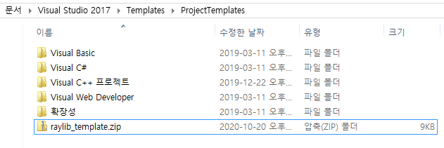

저는 초등학교 5학년 때쯤에 플래시 게임에 푹 빠져있었는데, 어느 날 게임을 하면서 "나도 이런 게임 하나 만들어보고 싶다..." 라는 생각이 들었습니다. 그렇게 저는 게임을 만들어보기 위해 처음으로 프로그래밍이라는 것을 접하게 됐는데, 그때 배웠던 프로그래밍 언어가 바로 C언어였습니다. 

서점에서 두꺼운 책을 하나 사고 모르는 내용은 인터넷으로 찾아보며 열심히 공부를 하다가 네이버에 "C언어로 게임 만들기"를 검색해본 저는 너무 당황하고 말았습니다. C언어로 만든 게임 예제가 전부 제가 생각했던 게임과는 너무나 다른 콘솔 게임밖에 없었기 때문이었습니다. 

그 이후로 저는 C언어에 대한 흥미를 완전히 잃어 다시 C언어를 공부할 생각은 전혀 하지 않고 있었는데, 대학교 입학 전에 우연히 깃허브에서 [raylib](https://github.com/raysan5/raylib)라는 라이브러리를 발견하게 되었습니다. "바로 이거지!" 라는 생각이 든 저는 raylib를 다운받아 예제를 하나씩 실행해보며 예제 소스 코드의 간결함에 빠져버렸고, raylib로 직접 게임을 만들어보며 지금처럼 C 프로그래밍을 재미있게 공부하게 되었습니다.

제가 이 글을 쓰게 된 이유는 혹시 저처럼 게임을 만들면서 C언어를 재미있게 공부하고 싶은 사람들에게 이런 방법이 있다는 것을 소개시켜주기 위해서입니다. 

\* 물론 순수 C언어로 게임을 만들 수 있는 방법에는 raylib 이외에도 SDL2 게임 라이브러리를 사용하는 방법 ([Lazy Foo' Productions - Beginning Game Programming v2.0](https://lazyfoo.net/tutorials/SDL/)에서 SDL2로 게임을 만드는 방법이 소개되어 있습니다), [Allegro](https://github.com/liballeg/allegro5) 게임 라이브러리를 사용하는 방법, OpenGL나 DirectX 그래픽 API, 또는 윈도우 API를 직접 사용하는 방법 등도 있습니다.

<br />

# 목차

1. [raylib 라이브러리 소개](#c1)
2. [윈도우 8.1에서 raylib 라이브러리 빌드하기](#c2)
3. [우분투 18.04 LTS에서 raylib 라이브러리 빌드하기](#c3)
4. [우분투 18.04 LTS에서 윈도우 플랫폼용 라이브러리 빌드하기](#c4)

<br />

## raylib 라이브러리 소개 {#c1}

> raylib는 재미있는 게임 프로그래밍을 위해 만들어진 간결하고 사용하기 쉬운 라이브러리입니다.
>
> raylib는 Borland BGI 그래픽 라이브러리와 XNA 프레임워크의 영향을 많이 받았으며, 게임 프로토타입을 제작하거나, 그래픽 소프트웨어와 같이 사용하거나, 임베디드 소프트웨어를 개발하거나, 프로그래밍 교육용으로 사용하기에 적합한 라이브러리입니다.
>
> raylib는 윈도우, 리눅스, macOS, 라즈베리 파이, 안드로이드, 웹 등의 다양한 플랫폼을 지원하며, 이와 다른 플랫폼이라도 C언어와 OpenGL 그래픽 API를 지원하는 플랫폼이라면 raylib를 쉽게 이식할 수 있습니다.
>
> raylib는 C#, 고, 파이썬, 루비, 루아, 러스트 등의 다양한 프로그래밍 언어를 지원하며, 그 외의 언어 바인딩에 대한 내용은 [여기](https://github.com/raysan5/raylib/blob/master/BINDINGS.md)서 확인하실 수 있습니다.
>
> \- [raylib 공식 홈페이지](https://www.raylib.com/)

<br />

## 윈도우 8.1에서 raylib 라이브러리 빌드하기 {#c2}


- 먼저 [raylib의 공식 깃허브 저장소](https://github.com/raysan5/raylib)에서 raylib를 다운받습니다.

<br />


- 그 다음은 [여기](https://github.com/jdeokkim/raylib_wiki_kr)서 raylib 라이브러리 빌드에 필요한 비주얼 스튜디오 솔루션 파일과 템플릿 파일을 다운받습니다.

<br />


- `raylib-master.zip` 파일을 열고, `raylib-master` 폴더 안의 `src` 폴더를 복사합니다. 그런 다음, `raylib_wiki_kr-main.zip`을 열고 `raylib_wiki_kr-main` 폴더의 압축을 풀어줍니다. 압축을 풀면 `raylib_build_vs2017`라는 폴더가 있을텐데, 그 안의 `src` 폴더를 삭제하고 아까 복사한 `src` 폴더를 여기에 붙여넣습니다. 

<br />


- `raylib_build_vs2017.sln` 솔루션 파일을 열고, 개발 환경이 32비트일 경우 플랫폼을 `Debug, x86`, 64비트일 경우 `Debug, x64`로 설정합니다.

<br />


- `솔루션 빌드`를 클릭합니다.

<br />


- 플랫폼에 따라 `libraylib_x86d.lib` 또는 `libraylib_x64d.lib`이 생성되어 있는 것을 확인합니다.

<br />



- `raylib_wiki_kr-main` 폴더 안의 `raylib-template.zip`을 여기로 복사합니다.

<br />


- 위 스크린샷을 참고하여 새 raylib 프로젝트를 만듭니다.

<br />


- 새 raylib 프로젝트의 폴더로 들어가면 `src` 폴더가 있을텐데, 그곳에 `lib`라는 폴더를 만들고, 다시 그 안에 `raylib`라는 폴더를 만든 다음, `raylib` 폴더 안에 `raylib_build_vs2017`의 `src` 폴더에 있던 모든 파일 (raylib 라이브러리)과 `libraylib_x86d.lib` 또는 `libraylib_x64d.lib` 파일을 복사해줍니다.

<br />


- `Ctrl + F5`를 눌러 게임 프로젝트를 빌드합니다.

<br />


- `raylib 라이브러리 예제`가 실행되는 것을 확인합니다.

<br />

## 우분투 18.04 LTS에서 raylib 라이브러리 빌드하기 {#c3}

```console
# sudo apt install build-essential git
패키지 목록을 읽는 중입니다... 완료
의존성 트리를 만드는 중입니다
상태 정보를 읽는 중입니다... 완료
패키지 build-essential는 이미 최신 버전입니다 (12.4ubuntu1).
패키지 git는 이미 최신 버전입니다 (1:2.17.1-1ubuntu0.4).
0개 업그레이드, 0개 새로 설치, 0개 제거, 20개 업그레이드 안 함.

# sudo apt-get update
기존:1 http://ap-northeast-2.ec2.archive.ubuntu.com/ubuntu bionic InRelease
받기:2 http://ap-northeast-2.ec2.archive.ubuntu.com/ubuntu bionic-updates InRelease [88.7 kB]
받기:3 http://ap-northeast-2.ec2.archive.ubuntu.com/ubuntu bionic-backports InRelease [74.6 kB]
... (생략)
패키지 목록을 읽는 중입니다... 완료
W: An error occurred during the signature verification. The repository is not updated and the previous index files will be use
... (생략)
W: Some index files failed to download. They have been ignored, or old ones used instead.

# sudo apt install libasound2-dev mesa-common-dev libx11-dev libxrandr-dev libxi-dev xorg-dev libgl1-mesa-dev libglu1-mesa-dev
패키지 목록을 읽는 중입니다... 완료
의존성 트리를 만드는 중입니다
상태 정보를 읽는 중입니다... 완료
다음의 추가 패키지가 설치될 것입니다 :
  libboost-filesystem1.65.1 libboost-system1.65.1 libcapnp-0.6.1 libdmx-dev libdmx1 libdrm-dev libegl-mesa0 libegl1
  ... (생략)  
  xorg-sgml-doctools xserver-xorg-dev xtrans-dev zlib1g-dev
제안하는 패키지:
  libasound2-doc libice-doc libsm-doc libxaw-doc libxcb-doc libxext-doc libxt-doc
다음 *새로운* 패키지들을 설치:
  libasound2-dev libboost-filesystem1.65.1 libboost-system1.65.1 libcapnp-0.6.1 libdmx-dev libdmx1 libdrm-dev libegl-mesa0
  ... (생략)
  xorg-sgml-doctools xserver-xorg-dev xtrans-dev zlib1g-dev
0개 업그레이드, 130개 새로 설치, 0개 제거, 20개 업그레이드 안 함.
14.9 M바이트 아카이브를 받아야 합니다.
이 작업 후 68.6 M바이트의 디스크 공간을 더 사용하게 됩니다.
계속 하시겠습니까? [Y/n] Y
... (생략)
libgl1-mesa-dev:amd64 (20.0.8-0ubuntu1~18.04.1) 설정하는 중입니다 ...
xserver-xorg-dev (2:1.19.6-1ubuntu4.7) 설정하는 중입니다 ...
libglu1-mesa-dev:amd64 (9.0.0-2.1build1) 설정하는 중입니다 ...
xorg-dev (1:7.7+19ubuntu7.1) 설정하는 중입니다 ...
Processing triggers for libc-bin (2.27-3ubuntu1) ...

#
```

- [여기](https://github.com/raysan5/raylib/wiki/Working-on-GNU-Linux)를 참고하여 raylib 라이브러리 빌드에 필요한 추가 도구 및 라이브러리를 설치합니다.

<br />

```console
# git clone https://github.com/raysan5/raylib.git
Cloning into 'raylib'...
remote: Enumerating objects: 148, done.
remote: Counting objects: 100% (148/148), done.
remote: Compressing objects: 100% (114/114), done.
remote: Total 26266 (delta 83), reused 66 (delta 34), pack-reused 26118
Receiving objects: 100% (26266/26266), 347.04 MiB | 7.87 MiB/s, done.
Resolving deltas: 100% (18511/18511), done.
Checking out files: 100% (739/739), done.
```

- raylib 깃허브 저장소를 `git clone`해줍니다.

<br />

```console
# cd raylib/src
# make
gcc  -c rglfw.c -Wall -D_DEFAULT_SOURCE -Wno-missing-braces -Werror=pointer-arith -fno-strict-aliasing -std=c99 -fPIC -s -O1 -Werror=implicit-function-declaration -I. -Iexternal/glfw/include -Iexternal/glfw/deps/mingw -DPLATFORM_DESKTOP -DGRAPHICS_API_OPENGL_33
... (생략)
ar rcs /workspace/raylib-gamedev/raylib/libraylib.a core.o shapes.o textures.o text.o utils.o rglfw.o models.o raudio.o
raylib static library generated (libraylib.a) in /workspace/raylib-gamedev/raylib!
```

- `make` 명령어로 raylib를 정적 라이브러리로 빌드합니다.

<br />

```console
# sudo make install
mkdir --parents --verbose /usr/local/lib
mkdir --parents --verbose /usr/local/include
cp --update --verbose /workspace/raylib-gamedev/raylib/libraylib.a /usr/local/lib/libraylib.a
'/workspace/raylib-gamedev/raylib/libraylib.a' -> '/usr/local/lib/libraylib.a'
cp --update raylib.h /usr/local/include/raylib.h
cp --update raymath.h /usr/local/include/raymath.h
cp --update rlgl.h /usr/local/include/rlgl.h
cp --update physac.h /usr/local/include/physac.h
raylib development files installed/updated!
```

- `make install`로 raylib를 설치합니다.

<br />

```console
# cd /workspace/raylib-gamedev
# mkdir -p raylib-example/src && cd raylib-example/src
```

```c
#include "raylib.h"

#define SCREEN_WIDTH 768
#define SCREEN_HEIGHT 512

#define TARGET_FPS 60

#define FONT_SIZE 72

#define STR_MESSAGE "hello, world...?"
#define STR_TITLE "\x72\x61\x79\x6C\x69\x62\x20\xEB\x9D\xBC\xEC\x9D\xB4\xEB\xB8\x8C\xEB\x9F\xAC\xEB\xA6\xAC\x20\xEC\x98\x88\xEC\xA0\x9C"

/* 현재 화면을 업데이트한다. */
void UpdateCurrentScreen(void);

int main(void) {
    InitWindow(SCREEN_WIDTH, SCREEN_HEIGHT, STR_TITLE);
    SetTargetFPS(TARGET_FPS);

    while (!WindowShouldClose())
        UpdateCurrentScreen();

    return 0;
}

/* 현재 화면을 업데이트한다. */
void UpdateCurrentScreen(void) {
    BeginDrawing();

    // 배경을 검은색으로 설정한다.
    ClearBackground(BLACK);

    // 그라데이션 효과가 적용된 직사각형을 그린다.
    DrawRectangleGradientV(
        0, 
        0, 
        SCREEN_WIDTH, 
        SCREEN_HEIGHT, 
        (Color) { 41, 128, 185, 255 }, 
        (Color) { 109, 213, 250, 255}
    );

    // 화면 가운데에 "hello, world...?" 문자열을 그린다.
    DrawText(
        STR_MESSAGE, 
        (SCREEN_WIDTH - MeasureText(STR_MESSAGE, FONT_SIZE)) / 2, 
        (SCREEN_HEIGHT - FONT_SIZE) / 2, 
        FONT_SIZE, 
        WHITE
    );
    
    EndDrawing();
}
```

- raylib 프로젝트 폴더를 하나 만들고, `src/main.c`에 위 코드를 입력합니다.

<br />

```console
# mkdir bin && gcc src/main.c -o bin/main -g -std=c99 -O2 -D_DEFAULT_SOURCE -lraylib -lGL -lm -lpthread -ldl -lrt -lX11
```


- `raylib 라이브러리 예제` 프로젝트를 빌드하고, 결과 파일을 실행합니다.

<br />

## 우분투 18.04 LTS에서 윈도우 플랫폼용 라이브러리 빌드하기 {#c4}

```console
# sudo apt install gcc-mingw-w64-x86-64
패키지 목록을 읽는 중입니다... 완료
의존성 트리를 만드는 중입니다
상태 정보를 읽는 중입니다... 완료
다음의 추가 패키지가 설치될 것입니다 :
  binutils-mingw-w64-x86-64 gcc-mingw-w64-base mingw-w64-common mingw-w64-x86-64-dev
제안하는 패키지:
  gcc-7-locales wine64
다음 *새로운* 패키지들을 설치:
  binutils-mingw-w64-x86-64 gcc-mingw-w64-base gcc-mingw-w64-x86-64 mingw-w64-common mingw-w64-x86-64-dev
0개 업그레이드, 5개 새로 설치, 0개 제거, 112개 업그레이드 안 함.
44.2 M바이트 아카이브를 받아야 합니다.
이 작업 후 303 M바이트의 디스크 공간을 더 사용하게 됩니다.
계속 하시겠습니까? [Y/n] Y
... (생략)
mingw-w64-common (5.0.3-1) 설정하는 중입니다 ...
mingw-w64-x86-64-dev (5.0.3-1) 설정하는 중입니다 ...
gcc-mingw-w64-x86-64 (7.3.0-11ubuntu1+20.2build1) 설정하는 중입니다 ...
```

- 우분투 18.04 LTS에서 raylib 프로젝트를 윈도우 플랫폼용으로 크로스 컴파일 (cross compile)하기 위해 `gcc-mingw-w64-x86-64` 패키지를 설치해줍니다.

<br />

```console
# cd raylib/src
# make clean
rm -fv *.o /workspace/raylib-gamedev/raylib/libraylib.a /workspace/raylib-gamedev/raylib/libraylib.bc /workspace/raylib-gamedev/raylib/libraylib.so*
'core.o'가 삭제됨
'models.o'가 삭제됨
'raudio.o'가 삭제됨
'rglfw.o'가 삭제됨
'shapes.o'가 삭제됨
'text.o'가 삭제됨
'textures.o'가 삭제됨
'utils.o'가 삭제됨
'/workspace/raylib-gamedev/raylib/libraylib.a'가 삭제됨
removed all generated files!
```

- `make clean` 명령어로 이전에 raylib를 빌드할 때 생성된 목적 파일 (object file)을 모두 제거해줍니다.

<br />

```console
# make OS=Windows_NT CC=x86_64-w64-mingw32-gcc AR=x86_64-w64-mingw32-ar
x86_64-w64-mingw32-gcc -c core.c -Wall -D_DEFAULT_SOURCE -Wno-missing-braces -Werror=pointer-arith -fno-strict-aliasing -std=c99 -s -O1 -Werror=implicit-function-declaration -I. -Iex
ternal/glfw/include -Iexternal/glfw/deps/mingw -DPLATFORM_DESKTOP -DGRAPHICS_API_OPENGL_33
... (생략)
ar rcs ../src/libraylib.a core.o shapes.o textures.o text.o utils.o rglfw.o models.o raudio.o
raylib static library generated (libraylib.a) in ../src!

# mv libraylib.a ../libraylib_l2w.a
```

- `make` 명령어로 raylib를 윈도우 플랫폼용 정적 라이브러리로 빌드합니다.

<br />

```console
# mkdir bin
# x86_64-w64-mingw32-gcc src/main.c -o bin/main.exe -g -I../raylib/src -O2 -std=c99 -L../raylib -Wl,--subsystem,windows -mwindows -lraylib_l2w -lopengl32 -lgdi32 -lwinmm -lpthread
```

- [우분투 18.04 LTS에서 raylib 라이브러리 빌드하기](#c3)에서 했던 것과 똑같이 `raylib` 프로젝트 폴더를 하나 만들고, `src/main.c`에 코드를 입력한 다음, `x86_64-w64-mingw32-gcc` 컴파일러를 사용해 프로젝트를 빌드하면, `main.exe`가 생성됩니다.

<br />