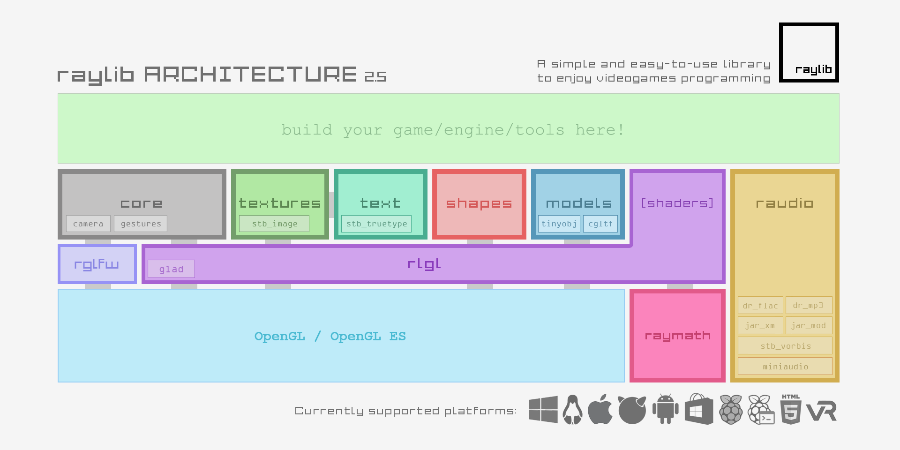
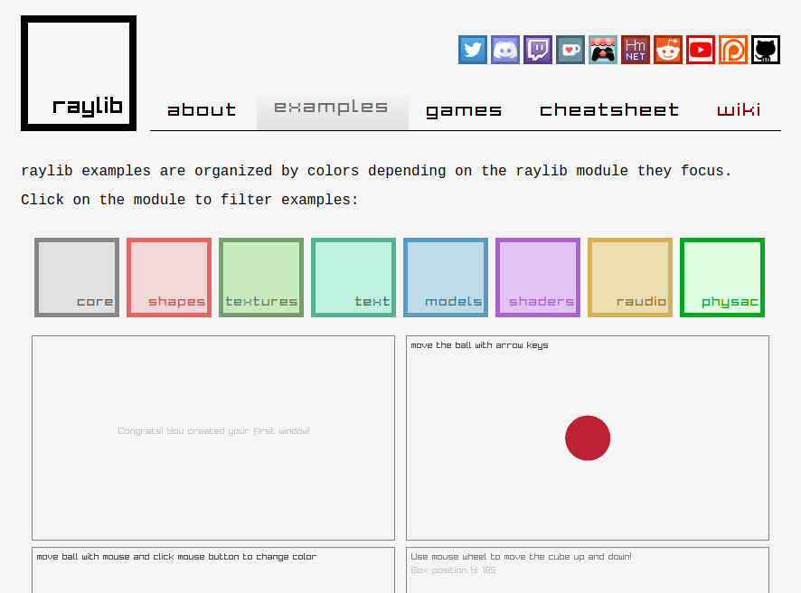

[C언어: raylib로 2D 그래픽 게임 만들기 Pt.1](https://jdeokkim.github.io/journal/making-a-2d-game-with-raylib-pt-1.html)에서는 raylib 라이브러리를 빌드하고 예제 프로그램을 직접 실행해보았습니다. 이번 글에서는 raylib 라이브러리에 대해 조금 더 알아보고, 저번 글에서 실행해본 예제 프로그램의 소스 코드를 분석해본 다음, raylib 라이브러리가 제공하는 다양한 예제 프로그램과 게임을 확인해보도록 하겠습니다.

<br />

# 목차

1. [raylib 깃허브 저장소에서 raylib 라이브러리 관련 문서 읽어보기](#c1)
2. ["hello, world...?" 예제 프로그램 소스 코드 분석하기](#c2)
3. [raylib 라이브러리의 다양한 예제 프로그램 확인하기](#c3)

<br />

## raylib 깃허브 저장소에서 raylib 라이브러리 관련 문서 읽어보기 {#c1}

[raylib 라이브러리 위키](https://github.com/raysan5/raylib/wiki)로 들어가보면 오른쪽 목차에 *'Library Design'*이 있을텐데, 이 중 raylib 라이브러리 구조에 대해 설명하는 ['raylib architecture'](https://github.com/raysan5/raylib/wiki/raylib-architecture)라는 글을 꼭 읽어보는 것이 좋습니다.



raylib 라이브러리 구조에 대해 간략히 설명하자면, raylib는 아래와 같이 7개의 주요 모듈로 구성되어 있습니다.

- [`core`](https://github.com/raysan5/raylib/blob/master/src/core.c): 게임 창, 그래픽 출력, 키보드와 컨트롤러 입력과 관련된 함수가 포함되어 있다.
- [`rlgl`](https://github.com/raysan5/raylib/blob/master/src/rlgl.h): 그래픽 API (OpenGL) 관련 함수가 포함되어 있다.
- [`shapes`](https://github.com/raysan5/raylib/blob/master/src/shapes.c): 직선, 원, 직사각형 등의 기본적인 2D 도형을 그릴 때 사용하는 함수가 포함되어 있다.
- [`textures`](https://github.com/raysan5/raylib/blob/master/src/textures.c): 사진이나 그림 파일을 불러오고 화면에 그리는 함수가 포함되어 있다.
- [`text`](https://github.com/raysan5/raylib/blob/master/src/text.c): 글꼴 데이터를 불러오고 화면에 그리는 함수가 포함되어 있다.
- [`models`](https://github.com/raysan5/raylib/blob/master/src/models.c): 3D 모델을 불러오고 화면에 그리는 함수가 포함되어 있다.
- [`raudio`](https://github.com/raysan5/raylib/blob/master/src/raudio.c): 소리 출력 장치를 관리하고 음악이나 효과음을 재생하는 함수가 포함되어 있다.

이 7개의 주요 모듈의 함수 원형은 `raylib.h`에 정의되어 있어, 게임 개발자가 raylib 라이브러리를 사용하려면 `raylib.h` 헤더 파일만 소스 코드에 포함시키면 raylib 라이브러리의 모든 함수를 사용할 수 있습니다. 또한 raylib 라이브러리에는 7개의 주요 모듈 외에도 추가적인 기능이 포함된 모듈이 몇 개 더 있습니다.

- [`raymath`](https://github.com/raysan5/raylib/blob/master/src/raymath.h): 평면 벡터 (`Vector2`), 공간 벡터 (`Vector3`), 행렬 (`Matrix`)과 쿼터니언 (`Quaternion`) 연산 함수가 포함되어 있다.
- [`camera`](https://github.com/raysan5/raylib/blob/master/src/camera.h): 자유 시점, 1인칭, 3인칭 등의 3D 카메라 관련 함수가 포함되어 있다.
- [`gestures`](https://github.com/raysan5/raylib/blob/master/src/gestures.h): 모바일 플랫폼에서 사용할 수 있는 터치 제스처 (탭, 스와이프, 드래그 등) 관련 함수가 포함되어 있다.
- [`raygui`](https://github.com/raysan5/raygui): 즉시 모드 GUI (immediate-mode GUI) 라이브러리이다.
- [`easings`](https://github.com/raysan5/raylib/blob/master/src/easings.h): 간단한 애니메이션 구현을 위한 함수가 포함되어 있다.
- [`physac`](https://github.com/victorfisac/Physac): 충돌 감지, 동역학 관련 함수가 포함되어 있는 2D 물리 엔진이다.

## "hello, world...?" 예제 프로그램 소스 코드 분석하기 {#c2}

```c
#include "raylib.h"

#define SCREEN_WIDTH 768
#define SCREEN_HEIGHT 512

#define TARGET_FPS 60

#define FONT_SIZE 72

#define STR_MESSAGE "hello, world...?"
#define STR_TITLE "\x72\x61\x79\x6C\x69\x62\x20\xEB\x9D\xBC\xEC\x9D\xB4\xEB\xB8\x8C\xEB\x9F\xAC\xEB\xA6\xAC\x20\xEC\x98\x88\xEC\xA0\x9C"

/* 현재 화면을 업데이트한다. */
void UpdateCurrentScreen(void);

int main(void) {
    InitWindow(SCREEN_WIDTH, SCREEN_HEIGHT, STR_TITLE);
    SetTargetFPS(TARGET_FPS);

    while (!WindowShouldClose())
        UpdateCurrentScreen();

    return 0;
}

/* 현재 화면을 업데이트한다. */
void UpdateCurrentScreen(void) {
    BeginDrawing();

    // 배경을 검은색으로 설정한다.
    ClearBackground(BLACK);

    // 그라데이션 효과가 적용된 직사각형을 그린다.
    DrawRectangleGradientV(
        0, 
        0, 
        SCREEN_WIDTH, 
        SCREEN_HEIGHT, 
        (Color) { 41, 128, 185, 255 }, 
        (Color) { 109, 213, 250, 255}
    );

    // 화면 가운데에 "hello, world...?" 문자열을 그린다.
    DrawText(
        STR_MESSAGE, 
        (SCREEN_WIDTH - MeasureText(STR_MESSAGE, FONT_SIZE)) / 2, 
        (SCREEN_HEIGHT - FONT_SIZE) / 2, 
        FONT_SIZE, 
        WHITE
    );
    
    EndDrawing();
}
```

[raylib 깃허브 저장소에서 raylib 라이브러리 관련 문서 읽어보기](#c1)에서 주요 모듈의 함수 원형은 모두 `raylib.h`에 정의되어 있다고 하였습니다. 그렇기 때문에 raylib 라이브러리에서 잘 모르는 함수가 있을 경우, `raylib.h`에서 함수 원형을 찾아 그 옆에 적힌 주석만 읽어보면 함수가 무슨 기능을 하는지 쉽게 알 수 있습니다.

먼저 `main` 함수부터 보겠습니다. `main` 함수에서는 `InitWindow`, `SetTargetFPS`와 `WindowShouldClose`라는 함수가 등장하는데, `raylib.h`에서 함수 원형을 찾아 주석을 읽어보면 
다음과 같은 내용을 확인할 수 있습니다.

```c
// Window-related functions
RLAPI void InitWindow(int width, int height, const char *title);  // Initialize window and OpenGL context
RLAPI bool WindowShouldClose(void);                               // Check if KEY_ESCAPE pressed or Close icon pressed

...

// Timing-related functions
RLAPI void SetTargetFPS(int fps);                                 // Set target FPS (maximum)
```

- `InitWindow`: 게임 창을 초기화하는 함수
- `SetTargetFPS`: 게임의 최대 FPS를 설정하는 함수
- `WindowShouldClose`: `ESC` 키 또는 창 종료 버튼이 눌렸을 경우 `true`, 그렇지 않을 경우 `false`을 반환하는 함수

<br />

`UpdateCurrentScreen` 함수에서도 똑같이 함수 원형을 찾아 주석을 읽어보도록 하겠습니다.

```c
// Drawing-related functions
RLAPI void ClearBackground(Color color);                          // Set background color (framebuffer clear color)
RLAPI void BeginDrawing(void);                                    // Setup canvas (framebuffer) to start drawing
RLAPI void EndDrawing(void);                                      // End canvas drawing and swap buffers (double buffering)

...

RLAPI void DrawRectangleGradientV(int posX, int posY, int width, int height, Color color1, Color color2); // Draw a vertical-gradient-filled rectangle

...

RLAPI void DrawText(const char *text, int posX, int posY, int fontSize, Color color);       // Draw text (using default font)
```

- `BeginDrawing`: 프레임버퍼를 초기화하고 게임 화면을 그리는 함수
- `ClearBackground`: 배경을 특정 색깔로 칠하는 함수
- `DrawRectangleGradientV`: 수직 그라디언트가 적용된 직사각형을 화면에 그리는 함수
- `DrawText`: 기본 글꼴로 문자열을 화면에 그리는 함수
- `EndDrawing`: 더블 버퍼링 (double buffering) 기법을 사용하여, 현재 게임 화면을 그리는 것을 끝내고 그 다음 게임 화면을 그릴 준비를 해주는 함수

<br />

## raylib 라이브러리의 다양한 예제 프로그램 확인하기 {#c3}



[raylib 공식 홈페이지](https://www.raylib.com)의 'examples' 메뉴를 클릭하면 raylib 라이브러리에서 제공하는 예제를 브라우저에서 직접 실행해볼 수 있습니다. 모든 예제는 그 예제와 관련있는 모듈에 따라 분류되어 있어, 어떤 기능을 하는지 알아보고 싶은 모듈이 있다면 그 모듈에 해당하는 예제만 따로 실행해볼 수 있습니다.
