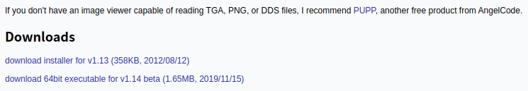
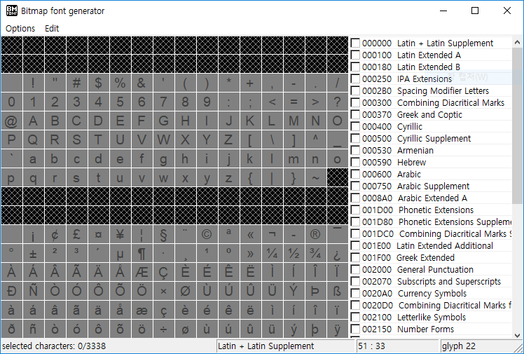
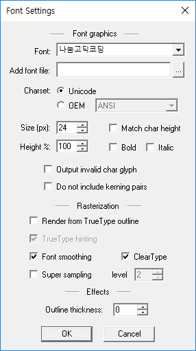
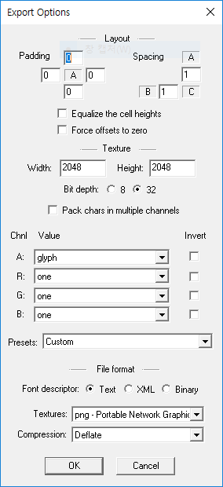
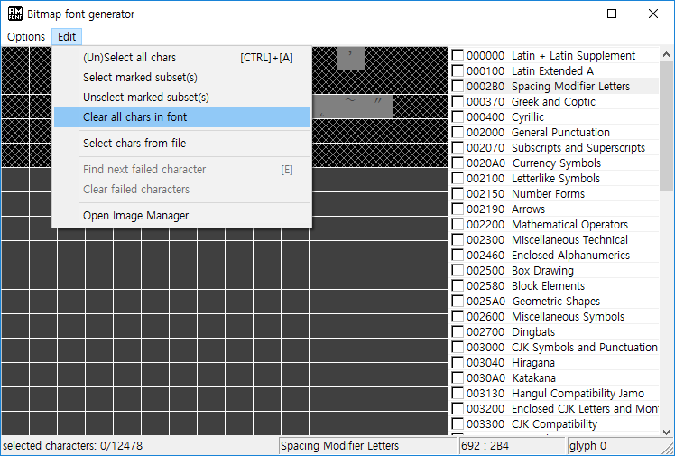
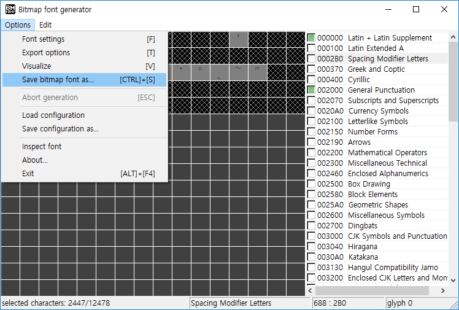

raylib에서 한글 글꼴을 사용하는 대표적인 방법에는 2가지가 있습니다. 첫 번째 방법은 `LoadFontEx` 함수를 이용해 `.ttf` 파일이나 `.otf` 파일을 불러와 사용하는 방법이고, 두 번째 방법은 `LoadFont` 함수를 이용해 비트맵 글꼴 파일인 `.fnt` 파일을 사용하는 방법입니다. 이번 글에서는 raylib의 `LoadFont`와 `LoadFontEx` 함수를 사용하여 한글 문자열을 표시하는 방법에 대해 알아보도록 하겠습니다.

<br />

# 목차

1. [비트맵 글꼴과 벡터 글꼴의 차이](#c1)
2. [Bitmap Font Generator로 비트맵 글꼴 만들기](#c2)
2. [`LoadFontEx` 함수로 TrueType 글꼴 (`.ttf`) 불러오기](#c3)
3. [`LoadFont` 함수로 비트맵 글꼴 파일 (`.fnt`) 불러오기](#c4)

<br />

## 비트맵 글꼴과 벡터 글꼴의 차이 {#c1}

컴퓨터에서 자주 사용되는 글꼴은 표현 방식에 따라 비트맵 글꼴 (bitmap font)과 벡터 글꼴 (vector font) 두 가지로 나눌 수 있습니다. 비트맵 글꼴은 화면을 구성하는 기본 단위인 픽셀 (pixel)로 글자를 표현하는 방식이고, 벡터 글꼴은 여러 개의 점을 이어서 만들어지는 곡선으로 글자를 표현하는 방식입니다. 

비트맵 글꼴은 처리 속도가 매우 빠르고 프로그래밍할 때 쉽게 사용할 수 있다는 장점이 있지만, 여러 개의 크기로 글꼴을 표현하기 위해서는 크기에 맞는 글꼴 이미지 파일이 필요하다는 단점이 있습니다. 벡터 글꼴은 비트맵 글꼴과 다르게 픽셀이 아닌 곡선으로 이루어져 있기 때문에 크기 등을 자유롭게 조정할 수 있다는 장점이 있지만, 처리 속도가 비트맵 글꼴에 비해 상대적으로 느리다는 단점이 있습니다.

### 비트맵 폰트

raylib에서는 비트맵 글꼴 표현을 위해 Andreas Jönsson의 [BMFont 글꼴 형식 (`.fnt`)](https://www.angelcode.com/products/bmfont/)을 지원합니다. BMFont 글꼴을 만들 수 있는 프로그램은 여러 가지가 있는데, 저 같은 경우 윈도우 환경에서는 주로 [Bitmap Font Generator](http://www.angelcode.com/products/bmfont/)를 사용하고, 리눅스 환경에서는 [Hiero](https://github.com/libgdx/libgdx/wiki/Hiero)나 [UBFG](https://github.com/scriptum/UBFG)를 많이 사용합니다.

### 벡터 폰트

벡터 글꼴은 가장 많이 사용되는 글꼴 형식에 따라 TrueType 글꼴 (`.ttf`)과 OpenType 글꼴 (`.otf`)로 나눌 수 있습니다. TrueType 글꼴은 애플 사가 1980년대에 개발한 글꼴 형식으로, 곡선을 구현하기 위해 2차 베지에 곡선을 사용합니다. OpenType 글꼴은 마이크로소프트 사와 어도비 사가 TrueType 글꼴을 기반으로 만든 글꼴 형식입니다. 

OpenType 글꼴은 곡선을 구현하기 위해 2차 또는 3차 베지에 곡선을 사용하는데, 3차 베지에 곡선을 사용하면 TrueType 글꼴에 비해 더 매끄럽고 깔끔한 곡선으로 글자를 표현할 수 있습니다. 또한 OpenType 글꼴은 TrueType 글꼴에 비해 표현할 수 있는 글자 수가 더 많으며, 렌더링된 문자의 모양이나 위치를 변경할 수 있는 기능을 제공한다는 장점도 가지고 있습니다.

\* 위 내용은 [Wikipedia의 'Computer font'](https://en.wikipedia.org/wiki/Computer_font)와 [raylib Wiki: Using BMFonts](https://github.com/raysan5/raylib/wiki/Using-BMFonts) 문서를 참고하여 작성하였습니다.

<br />

## Bitmap Font Generator로 비트맵 글꼴 만들기 {#c2}

### Bitmap Font Generator 사용하기



- [여기](https://www.angelcode.com/products/bmfont/)를 클릭하고, `Downloads`에서 `download 64bit executable for v1.14 beta`를 클릭하여 설치 없이 바로 실행할 수 있는 파일을 다운받습니다.

<br />



- Bitmap Font Generator를 실행하고, `Options` 메뉴의 `Font Settings`를 클릭합니다.

<br />



- `Font Settings`에서 `Font`, `Size` 등을 설정하고, `OK` 버튼을 클릭합니다.

<br />



- `Options` 메뉴의 `Export Settings`를 클릭하고, `Export Settings`에서 `Padding`, `Spacing`, `Width`, `Height`을 적당히 설정해준 다음, `Presets`를 `White text with alpha`로, `File format`은 `Font descriptor`를 `Text`로, `Textures`를 `png`로 설정해줍니다.

<br />



- 여기서 [`ksx1001_table_ucs2.txt`](https://raw.githubusercontent.com/jdeokkim/kraber/main/bitmap_font/res/font/ksx1001_table_ucs2.txt) 파일을 다운받고, `Edit` 메뉴에서 `Select chars from file`을 클릭한 다음, 다운받은 `ksx1001_table_ucs2.txt` 파일을 선택합니다.

<br />



- `Options` 메뉴에서 `Save bitmap font as...`를 선택하고, 원하는 이름을 입력하면 `.fnt` 파일과 `.png` 파일이 생성됩니다. 이 `.fnt` 파일과 `.png` 파일을 같은 폴더에 넣으면 비트맵 글꼴을 불러올 준비가 끝나게 됩니다.

<br />

## `LoadFontEx` 함수로 TrueType 글꼴 (`.ttf`) 불러오기 {#c3}

먼저 raylib의 [text 모듈](https://github.com/raysan5/raylib/blob/master/src/text.c)에서 `LoadFontEx` 함수의 원형을 확인해보겠습니다.

```c
// Load Font from TTF font file with generation parameters
// NOTE: You can pass an array with desired characters, those characters should be available in the font
// if array is NULL, default char set is selected 32..126
Font LoadFontEx(const char *fileName, int fontSize, int *fontChars, int charsCount);
```

- `const char *fileName`: 게임으로 불러올 TrueType 또는 OpenType 글꼴 파일의 위치이다.
- `int fontSize`: 글꼴의 크기를 지정하는 변수이다.
- `int *fontChars`: 글꼴로 나타낼 글자의 유니코드 배열을 가리키는 포인터이다.
- `int charsCount`: 글꼴로 나타낼 글자의 개수이다.

TrueType 글꼴을 사용하려면 아래와 같이 `LoadFontEx` 함수로 글꼴을 불러오고, `DrawTextEx` 함수로 화면에 문자열을 그리면 됩니다. 주의할 점은 TrueType 글꼴을 사용해서 한글을 표현할 때, 표현해야 되는 문자의 개수가 많아질수록 로딩 시간이 길어진다는 것입니다. 그렇기 때문에 저는 한글 표현을 위해 비트맵 폰트를 많이 사용하는 편입니다.

```c
#include "raylib.h"

#define TARGET_FPS 120

#define DEFAULT_WIDTH 640
#define DEFAULT_HEIGHT 480

#define FONT_SIZE 24
#define FONT_NUMCHARS 6

#define EXAMPLE_STR "\xEC\x95\x88\xEB\x85\x95\xED\x95\x98\xEC\x84\xB8\xEC\x9A\x94\x21"

static Font ft_example_ttf; // TrueType 표준을 따르는 글꼴

// 글꼴로 표현할 문자의 유니코드 목록
static int font_chars[FONT_NUMCHARS] = {
    0xC548, // 안
    0xB155, // 녕
    0xD558, // 하
    0xC138, // 세
    0xC694, // 요
    0x0021  // !
};

/* 게임 리소스를 비디오 메모리로 불러온다. */
void LoadResources(void);

/* 게임 리소스의 비디오 메모리를 해제한다. */
void UnloadResources(void);

/* 게임 화면을 업데이트한다. */
void UpdateCurrentScreen(void);

int main(void) {    
    SetTargetFPS(TARGET_FPS);
    
    InitWindow(DEFAULT_WIDTH, DEFAULT_HEIGHT, "...");
    
    LoadResources();

    while (!WindowShouldClose())
        UpdateCurrentScreen();
    
    UnloadResources();
    
    CloseWindow();

    return 0;
}

/* 게임 리소스를 비디오 메모리로 불러온다. */
void LoadResources(void) {
    ft_example_ttf = LoadFontEx(
        "res/font/example.ttf",
        FONT_SIZE,
        font_chars,
        FONT_NUMCHARS
    );
}

/* 게임 리소스의 비디오 메모리를 해제한다. */
void UnloadResources(void) {
    UnloadFont(ft_example_ttf);
}

/* 게임 화면을 업데이트한다. */
void UpdateCurrentScreen(void) {
    BeginDrawing();
    
    ClearBackground(RAYWHITE);
    
    DrawTextEx(
        ft_example_ttf,
        EXAMPLE_STR,
        (Vector2) { 
            8,
            8
        },
        FONT_SIZE,
        2,
        DARKGRAY
    );
    
    EndDrawing();
}
```

<br />

## `LoadFont` 함수로 비트맵 글꼴 파일 (`.fnt`) 불러오기 {#c4}

`LoadFont` 함수는 `LoadFontEx` 함수에 비해 매개 변수가 단 하나밖에 없습니다.

```c
// Load Font from file into GPU memory (VRAM)
Font LoadFont(const char *fileName);
```

- `const char *fileName`: 게임으로 불러올 TrueType, OpenType 또는 비트맵 글꼴 파일의 위치이다. `LoadFont` 함수로 TrueType 또는 OpenType 글꼴을 불러오는 경우, 글꼴의 크기는 `FONT_TTF_DEFAULT_SIZE` (32), 글꼴로 나타낼 글자의 유니코드 목록은 ASCII 코드 32번부터 126번까지 총 `FONT_TTF_DEFAULT_NUMCHARS` (95)개의 글자가 된다. 즉, `LoadFont` 함수로 벡터 글꼴을 불러오면 한글을 표현할 수 없게 된다. 비트맵 폰트는 벡터 글꼴과 달리 `.fnt` 파일에 글꼴 크기와 글꼴로 나타낼 글자의 목록이 기술되어 있으므로 `LoadFont` 함수를 사용하는 것이 편하다.

비트맵 글꼴을 사용하기 위해서는 아래와 같이 `LoadFont` 함수로 비트맵 글꼴을 불러오고, `DrawTextEx` 함수로 화면에 문자열을 그리면 됩니다.

```c
#include "raylib.h"

#define TARGET_FPS 120

#define DEFAULT_WIDTH 640
#define DEFAULT_HEIGHT 480

#define FONT_SIZE 24

#define EXAMPLE_STR "\xEC\x95\x88\xEB\x85\x95\xED\x95\x98\xEC\x84\xB8\xEC\x9A\x94\x21"

static Font ft_example_fnt; // BMFont 형식의 글꼴

/* 게임 리소스를 비디오 메모리로 불러온다. */
void LoadResources(void);

/* 게임 리소스의 비디오 메모리를 해제한다. */
void UnloadResources(void);

/* 게임 화면을 업데이트한다. */
void UpdateCurrentScreen(void);

int main(void) {    
    SetTargetFPS(TARGET_FPS);
    
    InitWindow(DEFAULT_WIDTH, DEFAULT_HEIGHT, "...");
    
    LoadResources();

    while (!WindowShouldClose())
        UpdateCurrentScreen();
    
    UnloadResources();
    
    CloseWindow();

    return 0;
}

/* 게임 리소스를 비디오 메모리로 불러온다. */
void LoadResources(void) {
    ft_example_fnt = LoadFont("res/font/example.fnt");
}

/* 게임 리소스의 비디오 메모리를 해제한다. */
void UnloadResources(void) {
    UnloadFont(ft_example_fnt);
}

/* 게임 화면을 업데이트한다. */
void UpdateCurrentScreen(void) {
    BeginDrawing();
    
    ClearBackground(RAYWHITE);
    
    DrawTextEx(
        ft_example_fnt,
        EXAMPLE_STR,
        (Vector2) { 
            8,
            8
        },
        FONT_SIZE,
        2,
        DARKGRAY
    );
    
    EndDrawing();
}
```

<br />